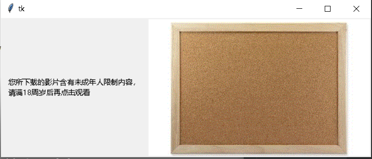
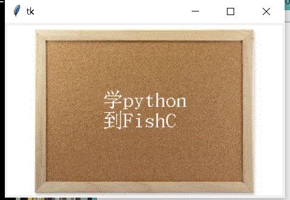

```python
from tkinter import *   #导入tkinter的所有模块

#使用tk功能，创建基本窗口
root = Tk()

#编辑标签(基于底层窗口)
textLabel = Label(root,text='您所下载的影片含有未成年人限制内容，\n请满18周岁后再点击观看',justify=LEFT,padx=10)
#放置标签(左对齐)
textLabel.pack(side=LEFT)


#实例化image对象得到一个可用的图片
photo = PhotoImage(file='18.gif')

#插入图片
abel=Label(root,image=photo)
abel.pack()   #(右对齐)


mainloop()
```

以上是插入图片，效果图




下面以图片作为背景使用

```python
from tkinter import *   #导入tkinter的所有模块

#使用tk功能，创建基本窗口
root = Tk()

photo = PhotoImage(file='18.gif')
theLabel = Label(root,text='学python\n到FishC',
				justify=LEFT,
				image=photo,
				compound=CENTER,
				font=('宋体',20),
				fg='white')

theLabel.pack()

mainloop()
```

效果图




### 按钮

```python
from tkinter import *   #导入tkinter的所有模块

def callback():
    var.set('吹吧，我才不信那')


#使用tk功能，创建基本窗口
root = Tk()


#框架
frame1 = Frame(root)
frame2 = Frame(root)

var = StringVar()
var.set('您所下载的影片含有未成年人限制内容，\n请满18周岁后再点击观看')

#编辑标签(基于底层窗口)
textLabel = Label(root,textvariable=var,justify=LEFT,padx=10)
#放置标签(左对齐)
textLabel.pack(side=LEFT)


#实例化image对象得到一个可用的图片
photo = PhotoImage(file='18.gif')

#插入图片
abel=Label(frame1,image=photo)
abel.pack()   #(右对齐)


theButton = Button(frame2,text='我已满18周岁',command=callback)
theButton.pack()

frame1.pack(padx=10,pady=10)
frame2.pack(padx=10,pady=10)


mainloop()
```

按钮的详细用法

https://fishc.com.cn/forum.php?mod=viewthread&tid=59124

