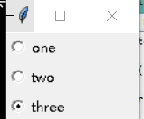

## 多选框（按钮）（Checkbutton）

```python
from tkinter import *
root = Tk()

#这个变量作为，是否被选择的显示
v = IntVar()

#按钮元素
c = Checkbutton(root,text='测试一下',variable=v)
c.pack()

#显示是否被按下，可不要（textvariable是显示变量的文本信息，动态的)
l = Label(root,textvariable=v)
l.pack()

mainloop()
```


```python
from tkinter import *
root = Tk()

GIRLS = ['西施','貂蝉','王昭君','杨玉环']

v = []

for girl in GIRLS:
    v.append(IntVar())      #存放按钮装状态
    b = Checkbutton(root,text=girl,variable=v[-1])
    b.pack(anchor=W) #显示出来的多选框左对齐
    #N上，W左，E右，S下


mainloop()
```

定义他们的位置


### 单选框（按钮）（Radiobutton）

```python
from tkinter import *
root = Tk()

v = IntVar()
Radiobutton(root,text='one',variable=v,value=1).pack(anchor=W)
Radiobutton(root,text='two',variable=v,value=2).pack(anchor=W)
Radiobutton(root,text='three',variable=v,value=3).pack(anchor=W)

#原理是什么，假设是第二个value的值为2，它会将2的值赋给v，当你点击2的时候，v去对比他们3个的值，


mainloop()
```




```python
from tkinter import *
root = Tk()

LANGS = [
	('python',1),
	('perl',2),
	('ruby',3),
	('lua',4)
]

v = IntVar()
v.set(1)

for lang,num in LANGS:
	b = Radiobutton(root,text=lang,variable=v,value=num) 
	b.pack(anchor=W)


mainloop()
```

效果图


如果不喜欢用圆点，可以使用按键

```python
from tkinter import *

root = Tk()

LANGS = [
    ('python', 1),
    ('perl', 2),
    ('ruby', 3),
    ('lua', 4)
]

v = IntVar()
v.set(1)

for lang, num in LANGS:
    b = Radiobutton(root, text=lang, variable=v, value=num, indicatoron=False)
    # indicatoron=False是不使用圆点点击，使用图标

    b.pack(fill=X)  # x横向填充

mainloop()
```


### 分组

```python
from tkinter import *

root = Tk()

group = LabelFrame(root,text='最好的脚本语言是？',padx=5,pady=5)
group.pack()


LANGS = [
    ('python', 1),
    ('perl', 2),
    ('ruby', 3),
    ('lua', 4)
]

v = IntVar()
v.set(1)

for lang, num in LANGS:
    b = Radiobutton(group, text=lang, variable=v, value=num)
    # indicatoron=False是不使用圆点点击，使用图标

    b.pack(fill=X)  # x横向填充

mainloop()
```

效果图

