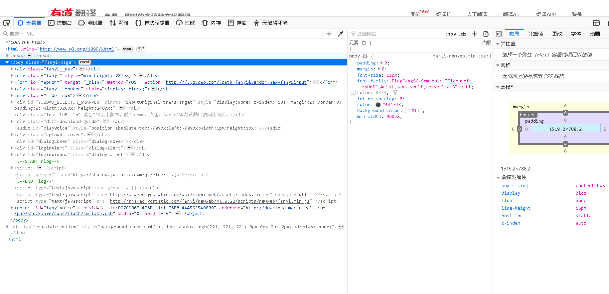
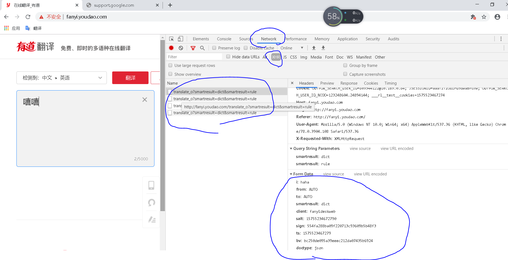
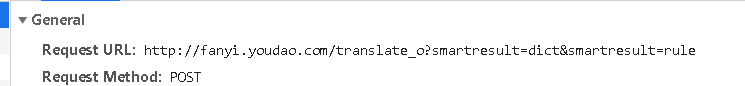
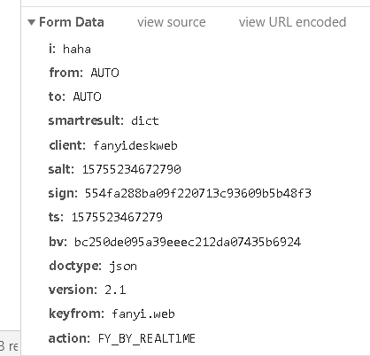

## 爬虫二 实战练习


访问一个网站（练习）

```
placekitten.com   #猫
```


案例1 爬取上面网络中的图片

```python
import urllib.request 

response = urllib.request.Request()

urllib.request.urlopen("http://placekitten.com/500/600")   #传入我们响应的连接 

cat_img = response.read()  #读取网页数据，将网络数据写入到cat_img变量中

with open("cat_500_600.jpg","wb") as f:       #将文件导出，重命名未cat_500_600 wb模式，到变量f，将f的数据写入到cat_img中
	f.write(cat_img)         #
```

案例解析

####  #导入网络模式

```python
import urllib.request        
```

#### #导入数据链接（拿到网页地址）

```python
req = urllib.request.Request("http://placekitten.com/500/600")
response = urllib.request.urlopen(req)         #就相当于，把链接作为一个对象，然后用open去手机request的对象，去解读
```

#### #读取数据的方法（将拿到的地址显示出来）（及详细信息）

```python
cat_img = response.read()      #读取response对象，按照源代码格式显示

response.geturl()    #得到你获取链接的地址，显示读取到的链接地址

print(response.info())       #得到一个你http链接的地址码（包括服务器的来源，使用的服务等等）（查看请求头部）

response.getcode        #返回服务器的状态信息（200.404等）
```

#### #数据保存在本地的方法

```python
with open("cat_500_600.jpg","wb") as f:       #将文件导出，重命名未cat_500_600 wb模式，到变量f，将f的数据写入到cat_img中
	f.write(cat_img)         #
```


## 案例2   有道词典


网站

```
fanyi.youdao.com
```

### IE和FireFox查看页面header信息需要插件

#### 但是火狐浏览器新版不支持插件了，所以我们用谷歌浏览器


查看网页元素



查看到网页的源代码

#### 查看network区域

### 


当我使用翻译功能的时候，网络服务器后对后端发出请求，和想要（主要有两种包  get post）



这些内容都是客户端和后端的通信内容

```
get 是对服务器去获取数据

post是将数据上传到后端服务器
```


```python
Remote Address 是服务器地址

Request URL     urlopen应该打开的是这个地址，这个地址才是提供翻译功能的地址

request Method: POST  请求方法是POST

Status Code 是连接状态 200是可连接，404是找不到

Request Headers   客户端（浏览器） 发送请求的Headers，服务端用来判断，是否是正常浏览器访问的（一般我们服务器用User-Agent来判断你是正常访问，还是非人类访问）

ps： python如果用代码来访问，User-Agent默认是pythonurl-3.7,防火墙一看就知道我们是代码，而不是浏览器访问，就给档掉了

Form Data ：  就是我们提交的主要内容
（i 后面是我们提交的信息明文）
```


### 关于.urlopen的完整格式

```
urllib.request.urlopen(url,date=None,[timeout,]*,cafile=None,)
```


### 我们在爬取一个方法之前需要知道，他的地址链接，和请求方法

我们现在需要请求的是翻译，就上传一个数据，然后服务器响应给我们即可，先找到请求的是什么链接



```
这里提一嘴我们拿到的链接是
http://fanyi.youdao.com/translate_o?smartresult=dict&smartresult=rule
但是我后边实战的时候，发现这是不可用的需要去掉中间的_o才可以，所以我们实际上用的链接是
http://fanyi.youdao.com/translate?smartresult=dict&smartresult=rule
```

在找到，客户端请求时的请求头部



然后开始编写

```python
import urllib.request
import urllib.parse  #parse现在不属于request的范围的模块了，所以要单独添加

haha = input('输入你想要 翻译的英语，目前只支持 （英译中）')

url = 'http://fanyi.youdao.com/translate?smartresult=dict&smartresult=rule'

date = {}               #这里做一个字典，将我们请求要上传的信息全都写到date中，另外，如果我们在下面urlopen中使用date，那么默认使用的请求方法就是POST

date['i'] = haha                #从这里开始
date['from'] = 'AUTO'
date['to'] = 'AUTO'
date['smartresult'] = 'dict'
date['client'] = 'fanyideskweb'
date['salt'] = '15755234720405'
date['sign'] = '393a0a7bc1d6619962c71ae755574915'
date['ts'] = '1575523472040'
date['bv'] = 'bc250de095a39eeec212da07435b6924'
date['doctype'] = 'json'
date['version'] = '2.1'
date['keyfrom'] = 'fanyi.web'
date['action'] = 'FY_BY_CLICKBUTTION'   #到这里结束，就是客户端的请求头部信息

    
date = urllib.parse.urlencode(date).encode('utf-8') #修改编码格式, .urlencode(data)就是将数据做成一个urlencode的文件个数，.encode('utf-8')就是将urlencode的文件格式做成一个utf-8的编码格式

response = urllib.request.urlopen(url,date) #如果这里的date被赋值了，那么这个请求就是以POST模式去请求

html = response.read().decode('utf-8') #.read()得到的是一个utf-8的编码形式的文件，  .decode('utf-8')就是将其他编码形式的文件更改为（utf-8的编码格式)，相当于，把.read()的编码文件，解码成一个utf-8的解码格式
print(html)

```

输出

```python
E:\pythonchengxu\python.exe E:/python脚本/untitled/test.py
                          {"type":"EN2ZH_CN","errorCode":0,"elapsedTime":1,"translateResult":[[{"src":"haha","tgt":"哈哈"}]]}      #虽然可以出来翻译结果，但是不怎么好看


Process finished with exit code 0
```


### 我们发现这个是一个json格式，我们可以把这个格式转换为我们的字典格式

```python
import json
json.loads(html)      #转换为字典格式
target['translateResult'][0][0]["tgt"]      #找到对应的键,因为有两次列表，所以用[0][0]，"tgt"是列表中的键，调用键，就可以得到值
```

## 所以最后得到的代码就是

```python
import urllib.request
import urllib.parse  # parse现在不属于request的范围的模块了，所以要单独添加
import json


while True:
    haha = input('输入你想要翻译的单词或语句：')
    url = 'http://fanyi.youdao.com/translate?smartresult=dict&smartresult=rule'
    date = {}  # 这里做一个字典，将我们请求要上传的信息全都写到date中，另外，如果我们在下面urlopen中使用date，那么默认使用的请求方法就是POST
    date['i'] = haha  # 从这里开始
    date['from'] = 'AUTO'
    date['to'] = 'AUTO'
    date['smartresult'] = 'dict'
    date['client'] = 'fanyideskweb'
    date['salt'] = '15755234720405'
    date['sign'] = '393a0a7bc1d6619962c71ae755574915'
    date['ts'] = '1575523472040'
    date['bv'] = 'bc250de095a39eeec212da07435b6924'
    date['doctype'] = 'json'
    date['version'] = '2.1'
    date['keyfrom'] = 'fanyi.web'
    date['action'] = 'FY_BY_CLICKBUTTION'  # 到这里结束，就是客户端的请求头部信息

    date = urllib.parse.urlencode(date).encode('utf-8')  # 修改编码格式, .urlencode(data)就是将数据做成一个urlencode的文件个数，.encode('utf-8')就是将urlencode的文件格式做成一个utf-8的编码格式

    response = urllib.request.urlopen(url, date)  # 如果这里的date被赋值了，那么这个请求就是以POST模式去请求

    html = response.read().decode('utf-8')  # .read()得到的是一个utf-8的编码形式的文件，  .decode('utf-8')就是将其他编码形式的文件更改为（utf-8的编码格式)，相当于，把.read()的编码文件，解码成一个utf-8的解码格式

    target = json.loads(html)  # 找到对应的键,因为有两次列表，所以用[0][0]，"tgt"是列表中的键，调用键，就可以得到值

    print(target['translateResult'][0][0]["tgt"])#找到对应的键,因为有两次列表，所以用[0][0]，"tgt"是列表中的键，调用键，就可以得到值

```

