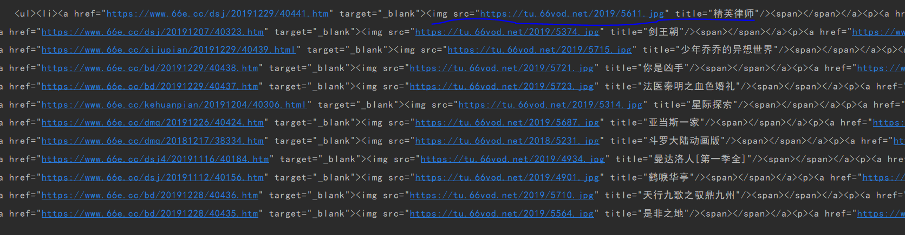

### python 爬虫

```python
#urllib模块是一个运用url的包，其中的urllib.request用来访问和读取urls的
import urllib.request


#urllib库还包括了其他3个包
import urllib
#1. 一个是urllib.error  这个包包括了所有urllib.request导致的异常
#2. urllib.parse用于解析urls
#3. urlib.robotparser用于解析robots.txt文件

#导入re库，做正则表达式的匹配，用来在获取的页面当中摘除指定内容
import re

def get_html(url):
    url=r'https://www.66e.cc/index.htm'
    #设定我们要打开的页面url地址
    #print(url) 可以尝试打印它
    page=urllib.request.urlopen(url)      #打开上面网络链接
    # request = page.read()
    # print(request)
    #html = page.decode('utf-8')
    print(page)
get_html(r'https://www.66e.cc/index.htm')
```


### 获取网站的源代码

```python
import urllib.request
import urllib
import re

def get_html(url):
    url=r'https://www.66e.cc/index.htm'
    page=urllib.request.urlopen(url)
    request = page.read()
    # print(request)
    #将网页转码后显示出来（gbk 简体中文）
    html = request
    html = html.decode('gbk')  # 字符集转换，默认是二进制的，没法看，先查看网络上人家的源字符集是什么，然后转换成对应的字符集
    print(html)
get_html(r'https://www.66e.cc/index.htm')


```

成功得到该网站的源代码

找到这些图片结构 src区域



根据图片的获取格式，获取到图片链接以及图片名称

```python
比如随便拿一个链接
 6:
            f += 1
        print(movies[each],links[0])

    print('\n其中大于6分的有%d部'%f)

    
if __name__=="__main__":
    for i in range(1,11):        #遍历1-11页
        print("\n第%d页"%i)       #输出页数
        url = ('https://www.80s.tw/movie/list/-----p%d'% i)    #拿到网站地址，第一页 遍历
        get_img(open_url(url))    #将拿到的url去封装伪装浏览器
        
        
        
```


## 案例2 

我们爬取一个网站

```mysql
http://www.idyjy.com/       #电影网站 具有下载链接
```

先拿到网站的源代码，并找到要爬取的图片及目标信息

```mysql
import urllib.request
import urllib
import re

def get_html(url):
    url=r'http://www.idyjy.com/'
    page=urllib.request.urlopen(url)
    request = page.read()
    html = request
    html = html.decode('gbk')
	print(html)

get_html('http://www.idyjy.com/')
```

#我们要爬取，图片链接，图片位置，下载地址

```python
1. #该页面的跳转链接
<a class="play-img" target="_blank" href="http://www.idyjy.com/sub/32211.html" title="剑王朝[电视剧版]" >
#编写跳转页面的链接正则
req = r'<a class="play-img" target="_blank" href="(http.+?\.jpg)" title="(.*?)" >'


2. #该页面图片和链接

#根据上述条件写图片和图片链接的正则
    req = ''
    
    
#"(http.+?\.jpg)"  匹配http开头
#alt="(.*?)" 任意字符串
```

根据规则去匹配图片和跳转链接

```python
import urllib.request
import urllib
import re

def get_html(url):
    url=r'http://www.idyjy.com/'
    req = urllib.request.Request(url)        #伪装浏览器
    req.add_header('User-Agent',
                   'Mozilla/5.0 (Windows NT 10.0; WOW64) AppleWebKit/537.36 (KHTML, like Gecko) Chrome/53.0.2785.104 Safari/537.36 Core/1.53.4843.400 QQBrowser/9.7.13021.400')
    page=urllib.request.urlopen(req)
    request = page.read()
    html = request
    html = html.decode('gbk')
    return html

req=r''  #我们上面写的正则表达规则

reg_img =re.compile(req)         #用规则

imglist=reg_img.findall(get_html('http://www.idyjy.com/'))    #规则去匹配网站链接

for i in imglist:         #将列表遍历
    print(i[0])        #获取链接
    print(i[1])        #获取图片名称
```

### 将链接和图片信息拿到手，可以先把他们下载下来了

```mysql
import urllib.request
import urllib
import re

def get_html(url):
    url=r'http://www.idyjy.com/'
    req = urllib.request.Request(url)       
    req.add_header('User-Agent',
                   'Mozilla/5.0 (Windows NT 10.0; WOW64) AppleWebKit/537.36 (KHTML, like Gecko) Chrome/53.0.2785.104 Safari/537.36 Core/1.53.4843.400 QQBrowser/9.7.13021.400')
    page=urllib.request.urlopen(req)
    request = page.read()
    html = request
    html = html.decode('gbk')
    return html

req=r''

reg_img =re.compile(req)

imglist=reg_img.findall(get_html('http://www.idyjy.com/'))

for i in imglist:         #将列表遍历
    filename = i[1] #获取图片名称
    urllib.request.urlretrieve(i[0],'static/'+ str(filename) + '.jpg')   #下载连接，存放图片路径，
    print('图片' + str(filename) + '抓取完毕')
```

### #成功拿到了图片和图片名称，现在去爬取图片电影所存在的链接

```python
import urllib.request
import urllib
import re

def get_html(url):
    url=r'http://www.idyjy.com/'
    req = urllib.request.Request(url)        #伪装浏览器
    req.add_header('User-Agent',
                   'Mozilla/5.0 (Windows NT 10.0; WOW64) AppleWebKit/537.36 (KHTML, like Gecko) Chrome/53.0.2785.104 Safari/537.36 Core/1.53.4843.400 QQBrowser/9.7.13021.400')
    page=urllib.request.urlopen(req)
    request = page.read()
    html = request
    html = html.decode('gbk')
    return html

#多重正则连续筛选
req = r'<a class="play-img" target="_blank" href="(http.+?)" title="(.*?)" >'          #将另一条规则也写上去
reg_img =re.compile(req)

imglist=reg_img.findall(get_html('http://www.idyjy.com/'))

for i in imglist:         #将列表遍历
     filename = i[1] #获取图片名称
     urllib.request.urlretrieve(i[2],'static/'+ str(filename) + '.jpg')   #下载连接，存放图片路径，
     print(i[0])
     print('图片' + str(filename) + '抓取完毕')
```

#这时我们把i[0]的页面中检索 下载链接

随便拿两条链接

```
thunder://QUFodHRwOi8vY2FpemkubWVpenVpZGEuY29tLzE5MTIvUVlOUVlOLTAxLm1wNFpa
thunder://QUFodHRwOi8vY2FpemkubWVpenVpZGEuY29tLzE5MTIvUVlOUVlOLTAyLm1wNFpa
```

相当于再做了一个打开页面

```
例如这个
http://www.idyjy.com/sub/32050.html
```

```python
import urllib.request
import urllib
import re

def get_html(url):
    url=r'http://www.idyjy.com/sub/32050.html'
    req = urllib.request.Request(url)        #伪装浏览器
    req.add_header('User-Agent',
                   'Mozilla/5.0 (Windows NT 10.0; WOW64) AppleWebKit/537.36 (KHTML, like Gecko) Chrome/53.0.2785.104 Safari/537.36 Core/1.53.4843.400 QQBrowser/9.7.13021.400')
    page=urllib.request.urlopen(req)
    request = page.read()
    html = request
    html = html.decode('gbk')
    print(html)
get_html('http://www.idyjy.com/sub/32050.html')
```


```mysql
<a href="thunder://QUFodHRwOi8vY2FpemkubWVpenVpZGEuY29tLzE5MTIvUVlOUVlOLTAxLm1wNFpa" title="QYNQYN-01.mp4">

#写正则
req = r'<a href="thunder://(.*?)" title="(.*?)">'
```

根据正则去匹配下载地址

```python
import urllib.request
import urllib
import re

def get_html(url):
    url=r'http://www.idyjy.com/sub/32050.html'
    req = urllib.request.Request(url)
    req.add_header('User-Agent',
                   'Mozilla/5.0 (Windows NT 10.0; WOW64) AppleWebKit/537.36 (KHTML, like Gecko) Chrome/53.0.2785.104 Safari/537.36 Core/1.53.4843.400 QQBrowser/9.7.13021.400')
    page=urllib.request.urlopen(req)
    request = page.read()
    html = request
    html = html.decode('gbk')
    return html

req = r'<a href="thunder://(.*?)" title="(.*?)">'

reg_img =re.compile(req)         #用规则

imglist=reg_img.findall(get_html('http://www.idyjy.com/sub/32050.html'))    #规则去匹配网站链接

for i in imglist:         #将列表遍历
    print(i[0])        #获取迅雷下载链接
    print(i[1])        #获取链接名称
```


## 将两个脚本合并

```python
import urllib.request
import urllib
import re


def get_html(url=r'http://www.idyjy.com/'):
    req = urllib.request.Request(url)  # 伪装浏览器
    req.add_header('User-Agent',
                   'Mozilla/5.0 (Windows NT 10.0; WOW64) AppleWebKit/537.36 (KHTML, like Gecko) Chrome/53.0.2785.104 Safari/537.36 Core/1.53.4843.400 QQBrowser/9.7.13021.400')
    page = urllib.request.urlopen(req)
    request = page.read()
    html = request
    haha = html.decode('gbk')
    return haha


# 多重正则连续筛选
req = r'<a class="play-img" target="_blank" href="(http.+?)" title="(.*?)" >'  # 将另一条规则也写上去
reg_img = re.compile(req)

imglist = reg_img.findall(get_html('http://www.idyjy.com/'))

tempx = 3
for i in imglist:  # 将列表遍历
    ceshi = []
    if tempx > 0:
        tempx -= 1
        filename = i[1]  # 获取图片名称
        print(i[0])
        urllib.request.urlretrieve(i[2], 'static/' + str(filename) + '.jpg')  # 下载连接，存放图片路径，
        print('图片' + str(filename) + '抓取完毕')

        # 将获取的图片电影网地址去查看源代码
        req2 = r'<a href="thunder://(.*?)" title="(.*?)">'
        reg_img2 = re.compile(req2)
        temp = get_html(i[0])
        imglist2 = reg_img2.findall(temp)
        for o in imglist2:
            # print('thunder://'+str(o[0]))
            ceshi.append('thunder://' + str(o[0]))

        print(ceshi)                #这里将所有的电影技术，迅雷链接都放到变量中根据网页调用
# 这里链接将所有的('thunder://'+str(o[0])) 的链接都放到变量中


```


### 我们得到了一个刚才电影的下载链接

