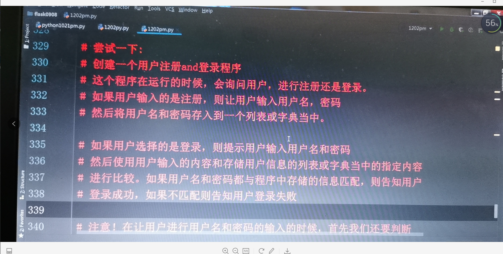
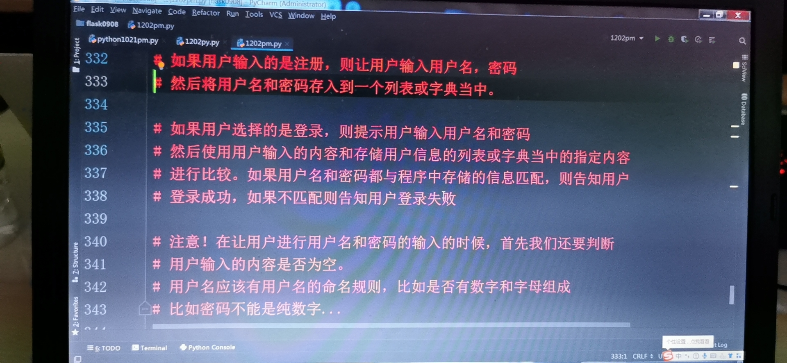

### 1. python当中的关键字----keyword

```python
很多的语言当中的都会有关键字，又叫做保留字段

因为我们的不同语言当中都会有一些特殊的英文单词有特殊的作用

这些单词不能再编程的时候，随意拿来进行赋值，更改他们本身的意思

比如:我们已经使用过的print，input，

不能拿来做变量，函数名，类名等等标识符
```


##### 1. 有那些关键字？

可以通过导入一个包，keywrod来讲所有python当中的关键字打印处理

```python
import keyword
print(keyword.kwlist) 

#打印所有的python关键字
```

输出

```python
['False', 'None', 'True', 'and', 'as', 'assert', 'async', 'await', 'break', 'class', 'continue', 'def', 'del', 'elif', 'else', 'except', 'finally', 'for', 'from', 'global', 'if', 'import', 'in', 'is', 'lambda', 'nonlocal', 'not', 'or', 'pass', 'raise', 'return', 'try', 'while', 'with', 'yield']
```


##### 2 python当中标识符的命名规则

```python
可以用'a-z'或'A-Z'字母和'0-9'数字以及下划线来作为标识符名称

但是要注意的是，不能是数字开头

如果使用' '单下划线或" "双下划线开头作为变量名，那么说明这个变量是一个类

当中的有特殊用处的变量
```


### 2.python当中的运算符


##### 1.算数运算符

```python
+   加   讲加号左右两边的变量或数据进行加法运算
-   减   讲减号左右两边的变量或数据进行加法运算
*  乘    讲乘号左右两边的变量或数据进行加法运算
/  除    讲除号左右两边的变量或数据进行加法运算
%  取模运算符   讲取模左右两边的变量或数据进行取模运算
** 次幂运算符   讲次幂左右两边的变量或数据进行次幂运算
// 向下整除运算符  讲整除左右两边的变量或数据进行整除运算
```

语法案例

```python
尝试一下
#设定3个变量a=2,b=4,c=0
a=2;b=4;c=0        //多个变量定义使用分号分割
```

###### 1#加法

```python
a=2;b=4;c=0 
c=a+b          //可以在变量计算时添加值
print('a+b=',c)  
```

 输出

```python
6
```


###### 2#减法

```python
a=2;b=4;c=0 
c=a-b
print('a-b=',c)
```

输出

```python
-2
```


###### 3#取模（取余）

```python
a=2;b=4;c=0 
c=b%a
print('b%a=',c)
```

输出

```python
0
```

###### 4 次幂 （次方）

```python
a=2;b=4;c=0
c=a**b
print('a**b=',c)
```

输出

```python
16
```


###### 5 整除 （//） 向下取整（不要小数点）

```python
a=2;b=4;c=0
c=b//a
print('b//a=',c)
```


##### 2.关系运算符

```python
#判断左右两个数据的关系的运算符，又叫做比较运算符

#用来判断两个数据是否相等，或谁大于谁，谁小于谁
```


###### #有那些关系运算符呢？

```python
== 等于，判断两个数字或两个字符串是否相等，如果相等则会返回布尔值（True）

!= 步相等，判断两个数字或字符串是否不等于 

> 大于 判断>左边的数字是否大于右边的数字
< 小于 判断<左边的数字是否小于右边的数字
>= 大于等于 判断左边的数字是否大于等于右边的数字
<= 小于或等于  判断左边的数字是否小于等于右边的数字
```

尝试1

```python
a=2;b=4
a == b #这样写判断了么？ 判断了但是没有进行结果的输出
print(a==b)
```

输出

```python
False       #因为等式不成立，2不等于4
```


尝试2

```python
a=2;b=4
c= a!=b          #这样可行吗，将比较结果赋值给一个变量
```

输出


##### 3.赋值运算符

用来给变量进行赋值操作的，但是在赋值的时候我们还可以进行运算

= 单纯的操作，会将=号右边的数据赋值给=左边的变量名承载

```python
+=    
-+
*=
/=
**=
//=
%=
```

他们是先将等号左侧的变量的值，与等号后面的数据进行算数运算，然后再将运算的结果再赋值给左侧的变量

案例：

```python
a=3;b=5
a+=b       #等于a=a+b
print(a)
```

输出

```python
8
```


##### 4.逻辑运算符

###### 与 或 非 （and or not）


（并且，或者，取反）


and 用来判断多个子判断在并列关系下的结果

举例：

判断吃不吃饭

#有两个条件决定我们吃还是不吃

```python
#条件1： 饿不饿  饿（True）不饿（False）
#条件2： 有没有钱   有钱（True)  没钱（False）


#and情况

我饿了（真），并且 我有钱（真）  == 吃~~呗  （真）
我饿了（真） 并且 我没钱（假）  == 不能吃了  （假）
我不饿（假） 并且 我有钱（真） == 我吃他干嘛，不吃 （假）
我不饿（假） 并且 我没钱（假） == 我就不吃 （假）


#or或者 这个逻辑，则是但凡有一个子系统呗满足了，那么最终的结果就为真

我饿了（真） 或者 我有钱（真）  == 吃  （真）
我饿了（真） 或者 我没钱（假）  == 吃  （真）
我不饿（假） 或者 我有钱（真）  == 吃 （真）
我不饿（假） 或者 我没钱（假）  == 不吃 （假）
只有当所有子判断结果都为假的情况下，最终的结果才为假

#not 取反 
a=10;b=20
print(not(a>b))

输出
True   #print(not(a>b))本来是不成立的，但是我们用not将其结果取反，最后输出的则是True
```


### 3 python当中对字符串的一系列判断

这里我们学习一些方法，用来对字符串内容进行判断

```python
isdigit()
```

#### 1. 对字符串内容进行判断

###### 

案例

```python
words=input('请输入一个数字:')
#判断这个字符串当中是否是全部由数字组成的
print(words.isdigit())
```

输出(正确)（输入纯数字）

```python
True
```

输出（错误）（输入非纯数字）

```python
False
```


###### 2. 检测是否由字符串组成（.isalpha()）

（中文，日语以及字母）（带数字，及特殊符号的都不可识别）

```python
words=input('请输入一个字符串:')
print(words.isalpha())
```

输出(正确)（输入字母）

```python
True
```

输出（错误）（输入非纯字母）

```python
False
```


###### 3.检测是否是数字加字母的组合组成才（.isalnum）

用来判断字符串是否由字母，数字组成，如果字符串里面

带有标点符号，或者是空字符串，都会是False，所有我们有

时候直接拿来判断用户是否输入了内容

```python
words=input('请输入一个字符加数字:')
print(words.isalnum())
```


###### 4 检测是否由大写或小写字母组成（.islower()）(.isupper())

```python
words=input('请输入一个字符加数字:')
print(words.islower())   #判断字符串是否由小写字母组成
print(words.isupper())   #判断字符串是否是大写字母组成
```


###### 5 将字符串转换为全小写（.lower()）,全大写.（upper()）

```python
words=input('请输入一个字符加数字:')
print(words.lower())    
print(words.upper())  
```


### 4   python当中的条件判断语句

##### if语句

```
if 要判断的条件：
   符合该条件做的事情
```

案例：

```python
userinfo=['zls','123.com']   #这里设定了一个userinfo列表
uname=input("请输入您的用户名:")  #程序开始后让用户输入一个用户名赋值给uname

if uname == userinfo[0]:   #判断uname变量的值是否与userinfo列表中第一个元素值相等
    upwd=input("请输入您的密码:")  #如果上面的条件成立的化，则提示让用户输入密码
    
                       #如果不符合上面的判断，那么程序没有给出对应的处理方法，就结束了
```


if判断语句是可以嵌套的

另外，我们在对没有符合条件的情况下的处理，怎么办那？

用到了另一个关键字，叫做，

##### else语句（否则）

临时写的，可以无视

```python
userinfo = ['zls', '123.com']

while True:            #做一个死循环
    uname = input("请输入您的用户名:" )
    if uname == userinfo[0]:
        upwd = input("请输入您的密码:")
        if upwd == userinfo[1]:
            print("登陆成功")
            break        #当用户登陆成功时，退出循环体
        else:
            print("密码错误")

    else:  # 否则的意思，用来处理符合条件之外的情况
        print("没有该用户")
```


尝试一下







```
len(uname) >= 4        //条件，字符串uname变量的长度，>=4位，
```


#简陋的

```python
import random

# 定义字典来存储用户及密码
users = {}
# 添加用户列表
list = []


#猜拳游戏函数
def caiquan():
    while True:
        xxx = input('是否进行猜拳游戏（y/n）退出输入Q/q即可')
        if xxx == 'y' or xxx == 'Y':
            print('开始游戏')
            test1 = ['石头', '剪刀', '布']
            ran = random.choice(test1)
            temp = input('我们来玩猜拳吧（石头，剪刀，布）任意一个')
            if temp == ran:
                print('平局')
            elif temp == '石头' and ran == '剪刀' or temp == '剪刀' and ran == '布' or temp == '布' and ran == '石头':
                print('犹豫了很久的你，艰难的战胜了新手难度(╯‵□′)╯︵┻━┻')

            elif temp == '石头' and ran == '布' or temp == '布' and ran == '剪刀' or temp == '剪刀' and ran == '石头':
                print('电脑获胜')
                print('电脑人迅速的战胜了你(*Φ皿Φ*)')
            else:
                print('输入有误，重新输入')

        elif xxx == 'Q' or xxx == 'q':
            exit()
        else:
           print('其余功能并没有开发，您可以留下来继续游玩，也可以输入Q退出')


#用户登陆
def denglu():
    # 用户登陆判断
    while True:        #判断数据库中是否存在该用户
        uname = input("请输入您的用户名:")
        for i in list:
            if uname == i:
                www = i
                upwd = input("请输入您的密码:")
                if upwd == users[www]:
                    print("登陆成功")
                    print('目前本项目正在逐渐开发完善，目前仅开放猜拳游戏')
                    caiquan()
                else:
                    print("密码错误")
            #else:  # 否则的意思，用来处理符合条件之外的情况
        print("没有该用户，请先注册用户")
        break

#用户注册
def zuce():
    global list
    global users
    while True:
        user = input("请输入您的用户名(3位以上）:")
        # 检查用户名是否由字符串（数字，字母）或文字组成，并且在3个以上
        if user.isalpha and len(user) > 3:
            print('满足条件')

            # 检测用户名冲突
            if user in list:
                print('******该用户名已被使用，请重新注册*******')
                continue
            else:

                # 输入密码
                uswd1 = input("请输入您的密码（至少8位）:")
                uswd2 = input("再次输入密码")
                # 判断两边密码是否正确，是否由数字字母组成，长度4位以上
                if uswd1 == uswd2 and uswd1.isalnum() and len(uswd1) >= 8:
                    list.append(user)
                    users[user] = uswd1  # 给users字典，添加键为用户名，值为密码
                    print("注册成功", '\n''您的账户是:', user, '\n', '您的密码是:', uswd1)
                    break
                else:
                    print('您输入的密码不满足要求')
                    print('是否由数字字母组成，长度4位以上')


        else:
            print('您输入的必须是一个数字加字符，并且长度大于3')

#主体函数
def main():
    '''
    主体函数
    '''
    while True:
        temp = input('登陆/注册')
        if temp == '登陆':
            denglu()
        elif temp == '注册':
            zuce()
        else:
            print('请正确输入')


if __name__ == '__main__':
    main()

```


### 5. 随机数 

为了使我们更有乐趣，使用随机数

#导入随机数模块

```python
import random
ran=random.randrange(54)  #设置随机数的范围是0-53
print(ran)

ran=random.randrange(1,55)  #1-54的取值范围随机
print(ran)

poker=['黑桃1','黑桃2','黑桃3','黑桃4','黑桃5','黑桃6','黑桃7','黑桃8','黑桃9','黑桃10','黑桃11','黑桃12','黑桃13'
       '红桃1','红桃2','红桃3','红桃4','红桃5','红桃6','红桃7','红桃8','红桃9','红桃10','红桃11','红桃12','红桃13'
       '梅花1','梅花2','梅花3','梅花4','梅花5','梅花6','梅花7','梅花8','梅花9','梅花10','梅花11','梅花12','梅花13'
       '方片1','方片2','方片3','方片4','方片5','方片6','方片7','方片8','方片9','方片10','方片11','方片12','方片13','大王','小王']

ran=random.choice(poker)   #从hiding的范围选择数值
```


今日作业，注册登陆

登陆后可以进行游戏

游戏内容可以进行选择

1，石头剪刀布


```python
import random as r
d = {0:[2,3,1],1:[1,2,3],2:[3,1,2],(True,False):'你赢了！',(False,True):'你输了！',(False,False):'平局'}
player = int(input('请输入你的选择(0:石头,1:剪刀,2:布):'))
index = r.randint(0,2)
print(d[(d[player][index] > d[index][index],d[player][index] < d[index][index])])
```

