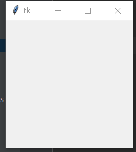
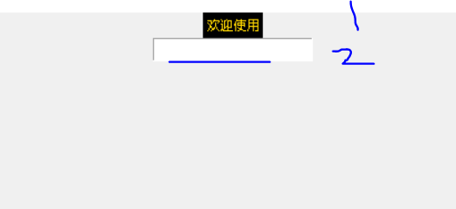
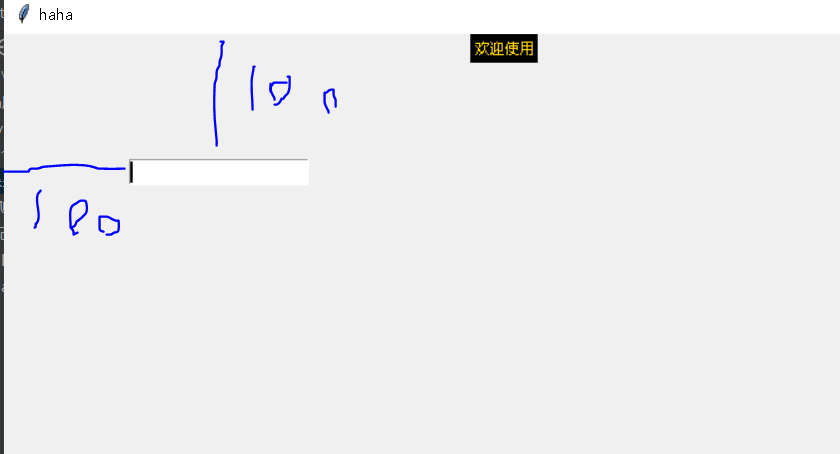
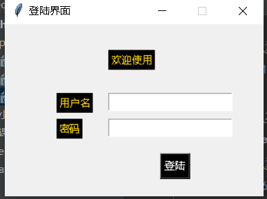

## TKinter（GUI） 图形化


使用python创建图形化界面程序

PY 原生的GUI图形化--TKinter

先调用一下这个库，并将其使用as关键字命名别名为tk

```python
import tkinter as tk     #as别名，tk
```

如何使用这个库呢

#### 1 TK()类实例化，不实例化无法使用

```python
import tkinter as tk
win=tk.Tk()          #产生一个图形化窗口，实例化
```


#### 2.  将窗口显示出来（循环显示，如果不循环显示的化，则只会闪烁一下就不见了）

```python
import tkinter as tk
win=tk.Tk()

win.mainloop()       #显示窗口
```




#### 3. 给窗口添加名称

```
import tkinter as tk
win=tk.Tk()
win.title('haha')     #窗口起名

win.mainloop()       
```


#### 4 窗口初始化大小

```python
import tkinter as tk
win=tk.Tk()
win.title('haha')   

win.geometry('800x600')    #设置窗口的初始大小 x轴乘以Y轴的窗口大小

win.mainloop()       
```


#### 5. 窗口是否可被缩放

```python
import tkinter as tk
win=tk.Tk()
win.title('haha')   
 
win.geometry('800x600')   

win.resizable(0,0)   # 0代表不允许缩放，x轴和y轴，任何非0 的数字都代表可以缩放。 
#如: (0,1)  y轴可缩放
#如: (1,0) x轴可缩放


win.mainloop()       
```

#### 6.给界面添加元素(Label--文字标签)

```python

import tkinter as tk
win =tk.Tk()
win.title('haha')

win.geometry('800x600')

win.resizable(0 ,0)

lab = tk.Label(win ,text='欢迎使用' ,bg='black' ,fg='gold')
#win   调用的是那个窗体中的
#text  标签要写的文本内容
#bg    标签的背景颜色
#fg    文本的字体颜色

# 这个内容只是设置了标签的内容和样式，但是我们并没有将标签放入窗体当中pack()这样一个布局函数
#放置标签(把写好的框架放到标签头部，win的窗口中，默认是在正中间)
lab.pack()  


win.mainloop()       
```

#### 7. 在程序运行中达成某条件下，取消标签

```python

import tkinter as tk
win =tk.Tk()
win.title('haha')
win.geometry('800x600')
win.resizable(0 ,0)
lab = tk.Label(win ,text='欢迎使用' ,bg='black' ,fg='gold')

lab.pack()  

#如果在程序执行后，达成某种条件的时候，我们要将该标签取消显示怎么办
lab.pack_forget() #pack_forget()函数用来取消元素的显示

win.mainloop()       
```


#### 8. 可让用户可以输入文本框的设置，使用了函数Entry()

```python
import tkinter as tk
win =tk.Tk()
win.title('haha')
win.geometry('800x600')
win.resizable(0 ,0)
lab = tk.Label(win ,text='欢迎使用' ,bg='black' ,fg='gold')
lab.pack()                  #我是元素1
#lab.pack_forget()         #这里先注释掉，方便显示

#定义
Ent = tk.Entry(win,text='快来填满我')

#放置Entry()对象
Ent.pack()                   #我是元素2
#注意! 元素的放置顺序，决定了该元素的放置位置
#如下所示的Entry()元素因为在放置Lable之前被放置了，所以图形化上显示出来，它也是在Label元素上面的
#另外，我们应该发现，在该界面当中，每一个元素都自己独占了一行内容(默认)


win.mainloop()       
```




根据pack() 的顺序来分布顺序

## 1  tkinter的布局方法

### 1.绝对布局 place()

#### 1 函数place()函数 （根据基础的窗口去定义其他元素的位置）

```
place(x=x轴坐标，y=y轴坐标)
```

演示

```python
import tkinter as tk
win =tk.Tk()
win.title('haha')
win.geometry('800x600')
win.resizable(0 ,0)
lab = tk.Label(win ,text='欢迎使用' ,bg='black' ,fg='gold')
lab.pack()                
lab.pack_forget()    


Ent = tk.Entry(win,text='快来填满我')


#Ent.pack()           #有全局的place了，这个就不要了 

Ent.place(x=100,y=100)    #默认是左上角的顶点开始，数值越大离顶点越远


win.mainloop()       
```




#### 2.按钮的窗口

```PYTHON
import tkinter as tk
win =tk.Tk()
win.title('haha')
win.geometry('800x600')
win.resizable(0 ,0)

#定义第一个文本元素
lab = tk.Label(win ,text='欢迎使用' ,bg='black' ,fg='gold')
lab.pack()               #其实这里我就该换place的，不过我懒，后面换了
#lab.pack_forget()         我是用来清除pack的，pack不用了，我也不用了


#定义交互窗口
Ent = tk.Entry(win,text='快来填满我')
#定义窗口元素坐标
Ent.place(x=100,y=100)    #默认是左上角的顶点开始，数值越大离顶点越远


#按钮窗口(元素)
hi_there = tk.Button(win, text='打招呼', bg='black', fg='white')
#可以在最后添加command=选项，当点击按钮后会执行的操作

#定义元素位置
hi_there.place(x=100,y=130)

win.mainloop()       
```


##### 小练习



```python
import tkinter as tk
win =tk.Tk()   #实例化
win.title('登陆界面')    #添加标题名称
win.geometry('300x200')    #主界面大小
win.resizable(0 ,0)       #不允许缩放界面大小

'''
    定义文本元素
'''
#定义第一个文本元素（欢迎登陆）
lab = tk.Label(win ,text='欢迎使用' ,bg='black' ,fg='gold',font=50)     #font 字体大小

#定义第一个元素的位置
lab.place(x=120,y=30)

#定义第二个文本元素(用户名）
lab = tk.Label(win ,text='用户名' ,bg='black' ,fg='gold')
#定义第一个元素的位置
lab.place(x=60,y=80)


#定义第三个文本元素(密码）
lab = tk.Label(win ,text='密码' ,bg='black' ,fg='gold')
#定义第一个元素的位置
lab.place(x=60,y=110)


'''
	定义交互窗口显示
'''

#定义第一个窗口元素
Ent = tk.Entry(win)      #基于win窗口
Ent.place(x=120,y=80)    #定义交互窗口的位置

#定义第二个窗口元素
Ent = tk.Entry(win)      #基于win窗口
Ent.place(x=120,y=110)    #定义交互窗口的位置

'''
	定义按钮
'''

#定义按钮
hi_there = tk.Button(win, text='登陆', bg='black', fg='white')
hi_there.place(x=180,y=150)


#保持窗口状态
win.mainloop()       
```


#### 3 获取文本框中的内容

在button()这个函数中，我加入了一个属性command

#这个属性来讲按钮绑定一个函数，command的等号后要绑定的函数名称

#获取文本框内容getValues()    

```python
import tkinter as tk
win =tk.Tk()   
win.title('登陆界面')    
win.geometry('300x200')   
win.resizable(0 ,0)       


#定义一个函数getValues，等待调用
def getValues():
    va1 = Ent1.get()      # 调用元素Ent1，利用元素功能get去获取文本框输入的信息
    va2 = Ent2.get()
    print(va1,va2)              #将用户输入的信息输出


'''
    定义文本元素
'''

lab1 = tk.Label(win ,text='欢迎使用' ,bg='black' ,fg='gold',font=50)     #font 字体大小
lab1.place(x=120,y=30)

lab2 = tk.Label(win ,text='用户名' ,bg='black' ,fg='gold')
lab2.place(x=60,y=80)

lab3 = tk.Label(win ,text='密码' ,bg='black' ,fg='gold')
lab3.place(x=60,y=110)


'''
	定义交互窗口显示
'''
Ent1 = tk.Entry(win)       #定义交互元素，等待用户输入
Ent1.place(x=120,y=80)     #这个元素的位置

Ent2 = tk.Entry(win)    
Ent2.place(x=120,y=110)    

'''
	定义按钮
'''

#定义按钮时添加command属性，当点击按钮后去调用getValues函数
hi_there = tk.Button(win, text='登陆', bg='black', fg='white',command=getValues)
hi_there.place(x=180,y=150)


#保持窗口状态
win.mainloop()
```


#### 4. 界面元素切换

```python
import tkinter as tk
win =tk.Tk()   
win.title('登陆界面')    
win.geometry('300x200')   
win.resizable(0 ,0)       


def getValues():
    va1 = Ent1.get()     
    va2 = Ent2.get()
    print(va1,va2)    
    #假设已经成功登陆了，则将当前界面上的所有内容清除掉
    
    lab1.pack_forget()
    lab2.pack_forget()
    lab3.pack_forget()
    Ent1.pack_forget()
    Ent2.pack_forget()


'''
    定义文本元素
'''

lab1 = tk.Label(win ,text='欢迎使用' ,bg='black' ,fg='gold',font=50)   
lab1.place(x=120,y=30)

lab2 = tk.Label(win ,text='用户名' ,bg='black' ,fg='gold')
lab2.place(x=60,y=80)

lab3 = tk.Label(win ,text='密码' ,bg='black' ,fg='gold')
lab3.place(x=60,y=110)


'''
	定义交互窗口显示
'''
Ent1 = tk.Entry(win)      
Ent1.place(x=120,y=80)     

Ent2 = tk.Entry(win)    
Ent2.place(x=120,y=110)    

'''
	定义按钮
'''

hi_there = tk.Button(win, text='登陆', bg='black', fg='white',command=getValues)
hi_there.place(x=180,y=150)


win.mainloop()
```


小实验，链接数据库

```python
import tkinter as tk
import pymysql
#定义全局窗口
win = tk.Tk()
win.title('登陆界面')
win.geometry('300x200')
win.resizable(0, 0)

# 初始化环境创建库，创建表
def initmysql():
    # 连接数据库创建zxz库
    db = pymysql.connect(host='192.168.1.1', port=3306,
                         user='root',
                         passwd='123.com',
                         charset='utf8')

    try:
        # 应用数据库连接
        cursor = db.cursor()
        cursor.execute('create database zxz')
        db.commit()

    except:
        print('\n')

    # 创建数据库链接
    db = pymysql.connect(host='192.168.1.1', port=3306,
                         user='root',
                         passwd='123.com',
                         charset='utf8', db='zxz')

    # 应用数据库连接
    cursor = db.cursor()
    # 在zxz库中创建表（存储用户信息） 应该是存在于初始化的时候

    # unique 独一无二的
    sql = 'create table sjbinfo( ID int(4) auto_increment primary key \
                     ,zname varchar(20) not null unique \
                     ,zpwd varchar(20) not null \
                     ,level int(4) \
                     ,jinbi int(4)\
                     ,jingyan int(4) \
                     ,lscs int(4)\
                     ,ycls int(4) \
                     ,jihuicishu int(4));'

    # 尝试执行sql语句
    try:
        cursor.execute(sql)  # 提交到我们的数据
        db.commit()
        print('\n')

    except:
        db.rollback()  # 如果报错的话，则回滚数据库（不修改数据库）

    # 关闭
    db.close()

initmysql()
# 链接数据库（update添加数据模块） 添加到表数据时传参update的sql命令即可 存储模块


#定义输入后
def getValues():
    va1 = Ent1.get()
    va2 = Ent2.get()

    db = pymysql.connect(host='192.168.1.1', port=3306,
                         user='root',
                         passwd='123.com',
                         charset='utf8', db='zxz')
    cursor = db.cursor()

    sql = 'select * from sjbinfo;'
    # 异常排查尝试
    cursor.execute(sql)  # 执行sql语句
    row = cursor.fetchall()
    db.close()

    for i in row:
        if va1 in i:
            if va2 == i[2]:
                print('登陆成功')
                lab1.place_forget()
                lab2.place_forget()
                lab3.place_forget()
                Ent1.place_forget()
                Ent2.place_forget()
                hi_there.place_forget()


    # 假设已经成功登陆了，则将当前界面上的所有内容清除掉


'''
    定义文本元素
'''

lab1 = tk.Label(win, text='欢迎使用', bg='black', fg='gold', font=50)
lab1.place(x=120, y=30)

lab2 = tk.Label(win, text='用户名', bg='black', fg='gold')
lab2.place(x=60, y=80)

lab3 = tk.Label(win, text='密码', bg='black', fg='gold')
lab3.place(x=60, y=110)

'''
    定义交互窗口显示
'''
Ent1 = tk.Entry(win)
Ent1.place(x=120, y=80)

Ent2 = tk.Entry(win)
Ent2.place(x=120, y=110)

'''
    定义按钮
'''

hi_there = tk.Button(win, text='登陆', bg='black', fg='white', command=getValues)
hi_there.place(x=180, y=150)


#结束
win.mainloop()

```


#### 5. 弹窗函数

```python
import tkinter.messagebox as tkm

#使用方法（弹窗）
tkm.showinfo('消息框标题','消息框内容')

#弹窗选项（True）/(False)
res = tkm.askokcancel('消息框标题','确认登陆吗')
print(res)
```


